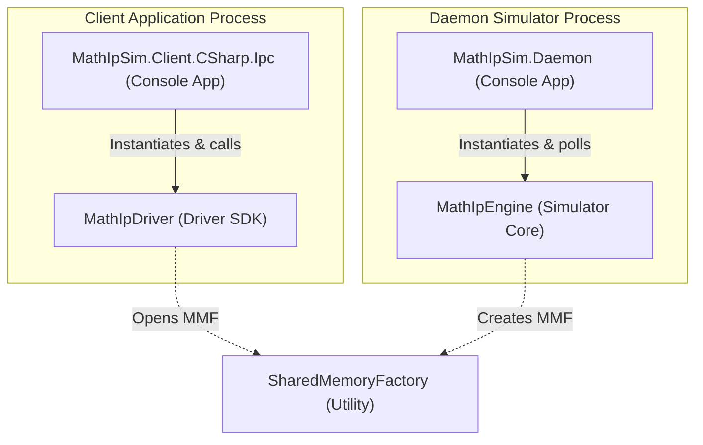
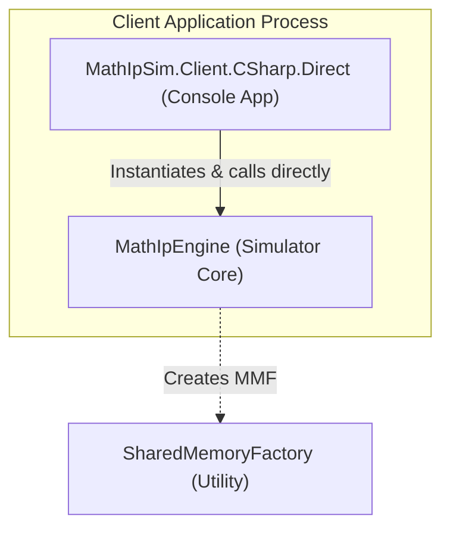

# Math IP Software Simulator

This project implements a pure-software version of an Integrated Circuit (IC) mathematical IP block. The core IP logic is developed in C# targeting **.NET Standard 2.0** for cross-platform compatibility (macOS and Windows). 

It is designed using a **Shared Memory Daemon** architecture to achieve process and fault isolation between the C# IP engine and its calling clients.

---


## Architecture Overview

This simulator is designed to support two distinct operational modes depending on your integration needs:

### 1. IPC Mode (Scenario 1: Multiprocess, Fault-Isolated, Cross-Language)
In this mode, client applications (written in C#, C, or other languages) communicate with a background **C# Daemon Process** via **Shared Memory (Memory Mapped Files)**. If the simulator crashes or runs into exception states, the client application is completely isolated and unaffected.

```
 ┌───────────────────────────────────┐        ┌───────────────────────────────────┐
 │       Client Process (Caller)     │        │     Daemon Process (C# Engine)    │
 │    (C/C# Client Application)      │        │     (Runs core math IP logic)     │
 └─────────────────┬─────────────────┘        └─────────────────┬─────────────────┘
                   │                                            │
  1. Write Inputs  │                                            │ 3. Detects GO=1
  2. Set Regs      │        ┌────────────────────────┐          │    Executes math
  & Trigger GO=1   └───────►│  Shared Memory (256KB) │◄─────────┘    Updates STATUS
                            │ - Data Space (0x20000) │               Clears GO=0
  5. Read Outputs  ┌◄───────│ - Reg Space  (0x39000) │
  & Check STATUS   │        └────────────────────────┘
                   ▼
```

#### Class & Process Relationship Diagram (IPC Mode)


### 2. Direct Mode (Scenario 2: Single-Process, High-Performance, C# Only)
In this mode, a C# client directly instantiates and executes the core math IP logic inside its own process namespace. Communication overhead is completely eliminated by calling standard C# APIs without any shared memory mapping.

```
 ┌──────────────────────────────────────────────────────────────────┐
 │                     Client Process (C# Caller)                   │
 │                                                                  │
 │    ┌───────────────────────────┐       ┌────────────────────┐    │
 │    │  Client Application Code  ├──────►│  MathIpEngine API  │    │
 │    │                           │ (Call)│  (In-Memory Math)  │    │
 │    └───────────────────────────┘       └────────────────────┘    │
 └──────────────────────────────────────────────────────────────────┘
```

#### Class & Process Relationship Diagram (Direct Mode)


## IP Specifications & Memory Layout

For complete technical specifications of the simulated hardware IP block—including its **Shared Memory Space Layout**, **32-bit Register Mapping (Base: `0x39000`)**, **Input/Output Vector Memory Offsets**, and **16-bit Saturation/Error Rules**—please refer to the:

👉 **[Pure-Software Math IP Specifications Document](docs/specs/2026-07-06-restructured-ip-sim.md)**

---

## Prerequisites

- **.NET 10.0 SDK** (Installed on macOS/Windows)
- **C Compiler**:
  - *macOS*: `clang` (via Xcode Command Line Tools)
  - *Windows*: MSVC (`cl.exe`) via Visual Studio, or MinGW (`gcc.exe`)

---

## Directory Structure

- [src/Simulators/MathIpSim.Simulator/](src/Simulators/MathIpSim.Simulator/): C# Class Library containing the core math simulation engine and shared memory factory.
- [src/Simulators/MathIpSim.Daemon/](src/Simulators/MathIpSim.Daemon/): C# Console App hosting the background daemon polling runner loop.
- [src/Clients/MathIpSim.Client.CSharp/](src/Clients/MathIpSim.Client.CSharp/): C# Client Driver SDK Library.
- [src/Clients/MathIpSim.Client.C/macOS/](src/Clients/MathIpSim.Client.C/macOS/): macOS-specific C driver SDK and demo script.
- [src/Clients/MathIpSim.Client.C/Windows/](src/Clients/MathIpSim.Client.C/Windows/): Windows-specific C driver SDK and demo batch file.
- [tests/](tests/): C# Unit/Integration tests and C-specific automated tests.

---

## Scenario 1: C# IPC calling (via Daemon)

In this scenario, a C# client connects to the running Simulator Daemon using the safe `MathIpDriver` over shared memory.

### 1. Build and Run
With the Simulator Daemon running in the background, run the IPC client:
```bash
dotnet run --project src/Clients/MathIpSim.Client.CSharp.Ipc/MathIpSim.Client.CSharp.Ipc.csproj
```

### 2. Execution Code Example
```csharp
using MathIpSim.Client.CSharp;

// 1. Instantiate the driver
using (var driver = new MathIpDriver())
{
    // Initialize connection to Shared Memory (Daemon must be running)
    driver.Init("MathIpSharedMemory");

    // 2. Prepare and write data arrays
    short[] aData = { 1, 2, 3 };
    short[] bData = { 4, 5, 6 };
    driver.WriteData(0x1000, aData, 3);
    driver.WriteData(0x2000, bData, 3);

    // 3. Set control registers
    driver.A_ADDRESS = 0x1000;
    driver.B_ADDRESS = 0x2000;
    driver.C_ADDRESS = 0x3000;
    driver.DATA_LEN  = 3;

    // 4. Trigger GO
    driver.GO = 1;

    // 5. Poll for completion
    while (driver.GO == 1)
    {
        System.Threading.Thread.Sleep(1);
    }

    // 6. Check for status flags
    if ((driver.STATUS & 0x01) != 0) Console.WriteLine("Warning: Div-by-zero!");
    if ((driver.STATUS & 0x02) != 0) Console.WriteLine("Warning: Saturation overflow!");

    // 7. Read outputs (3 elements * 4 operations = 12 results)
    short[] results = new short[12];
    driver.ReadData(0x3000, results, 12);
}
```

---

## Scenario 2: C# Direct In-Process calling

In this scenario, a C# application consumes the `MathIpEngine` directly in its own process, requiring no external processes or daemons.

### 1. Build and Run
Run the direct in-process calling client:
```bash
dotnet run --project src/Clients/MathIpSim.Client.CSharp.Direct/MathIpSim.Client.CSharp.Direct.csproj
```

### 2. Execution Code Example
```csharp
using MathIpSim.Simulator;

// 1. Instantiate the engine directly
using (var engine = new MathIpEngine())
{
    short[] aData = { 1, 2, 3 };
    short[] bData = { 4, 5, 6 };

    // 2. Write inputs using high-level API (no register manipulation needed)
    engine.WriteInputs(aData, bData);

    // 3. Execute math synchronously in-process
    engine.Execute();

    // 4. Read outputs
    short[] results = engine.ReadOutputs();
    uint status = engine.GetStatus();
}
```

---

## Scenario 3: macOS C Integration

In this scenario, a macOS C program calls the C# IP engine via the background Daemon.

### 1. Build and Run the C# Daemon (Server)
Start the background Daemon to host the simulated hardware:
```bash
dotnet run --project src/Simulators/MathIpSim.Daemon/MathIpSim.Daemon.csproj
```

### 2. Compile the macOS C Demo (Client)
Open a new terminal window, navigate to the macOS client directory, and run the build script:
```bash
cd src/Clients/MathIpSim.Client.C/macOS
sh build.sh
```
This compiles `math_ip_driver.c` and `main.c` into a native executable `c_demo`.

### 3. Run the Demo
```bash
./c_demo
```
The program will connect to the C# Daemon via `/tmp/MathIpSharedMemory`, execute the demo operations, and print the results step-by-step.

---

## Scenario 4: Windows C Integration

In this scenario, a Windows C program calls the C# IP engine via the background Daemon.

### 1. Build and Run the C# Daemon (Server)
Open Windows Command Prompt/PowerShell and run:
```cmd
dotnet run --project src/Simulators/MathIpSim.Daemon/MathIpSim.Daemon.csproj
```

### 2. Compile the Windows C Demo (Client)
Open the **Developer Command Prompt for Visual Studio** (for MSVC `cl.exe`) or a command window with MinGW `gcc.exe` in the PATH. Navigate to the Windows client directory and execute the build batch file:
```cmd
cd src\Clients\MathIpSim.Client.C\Windows
build.bat
```
This compiles `math_ip_driver.c` and `main.c` into `c_demo.exe`.

### 3. Run the Demo
```cmd
c_demo.exe
```
The program will connect to the C# Daemon via Windows Named Shared Memory `Local\MathIpSharedMemory`, execute operations, and print results.

---

## Verification & Tests

### Run C# Core & Integration Tests
Run all unit and integration tests (validating engine math, boundary overflows, and C# client-server IPC):
```bash
dotnet test
```

### Run C Language Integration Test (macOS/Unix)
With the C# Daemon running in the background, compile and run the automated C assertions:
```bash
clang tests/c_test/main.c src/Clients/MathIpSim.Client.C/macOS/math_ip_driver.c -I src/Clients/MathIpSim.Client.C/macOS/ -o tests/c_test/c_test_runner
./tests/c_test/c_test_runner
```
If successful, it will output `All assertions PASSED successfully!`.
