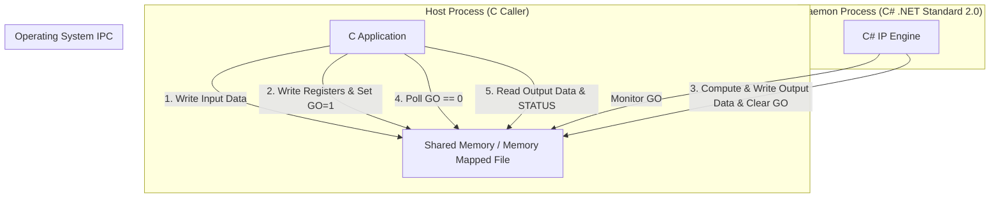

# Specification: Restructured Pure-Software Math IP Simulator

**Date:** 2026-07-06  
**Version:** 2.0  
**Status:** APPROVED

---

## 1. Introduction

This specification defines the design and interface for a pure-software version of an Integrated Circuit (IC) mathematical IP block. 
The software IP is designed to run cross-platform (macOS and Windows), implementing 16-bit signed integer calculations.

### Key Goals:
- **Language**: Core IP logic implemented in C# targeting **.NET Standard 2.0**.
- **Supported Callers**:
  1. Direct C# calling.
  2. C Language on macOS.
  3. C Language on Windows.
- **IPC Mechanism**: Shared Memory communication between the C callers and the C# Daemon.
- **Fault Isolation**: The IP processes run in isolation. A crash, hang, or exception in the C# IP engine will not cause the C caller process to crash.

---

## 2. Architecture Overview

To achieve fault isolation and cross-language support, a **Shared Memory Daemon** architecture is employed.



### Flow of Execution:
1. **Initialization**: The C# Daemon starts and initializes the Shared Memory segment.
2. **Input Preparation**: The C caller maps the shared memory, writes the input datasets (`a` and `b`) into the memory data space, and configures the register parameters.
3. **Trigger**: The C caller writes `1` to the `GO` register.
4. **Execution**: The C# IP Engine (polling the `GO` register) detects `GO == 1`, clears `STATUS`, performs the operations sequentially, writes outputs, updates `STATUS`, and resets `GO` to `0`.
5. **Completion**: The C caller, polling `GO`, detects `GO == 0`, checks `STATUS` for errors, and reads the results.

---

## 3. Shared Memory Specification

### Shared Memory Parameters
- **Segment Size**: 256 KB (`0x40000` bytes).
- **Identifier**: `MathIpSharedMemory`
  - *Windows*: System-wide Named Shared Memory (`Local\MathIpSharedMemory`).
  - *macOS*: POSIX Shared Memory path (`/MathIpSharedMemory`).

### Memory Space Layout
The Shared Memory segment is divided into distinct regions:

| Start Offset | End Offset | Size | Purpose | Description |
| :--- | :--- | :--- | :--- | :--- |
| `0x00000` | `0x1FFFF` | 128 KB | Reserved | Reserved for future expansion |
| `0x20000` | `0x30000` | 64 KB | **Data Space** | Holds input arrays `a`, `b` and output array `c` |
| `0x30001` | `0x38FFF` | ~36 KB | Reserved | Reserved |
| `0x39000` | `0x390FF` | 256 B | **Register Space** | IP Control and Status registers |
| `0x39100` | `0x40000` | ~28 KB | Reserved | Reserved |

---

## 4. Register Mapping (Base: `0x39000`)

All registers are aligned to 32-bit boundaries and represented as little-endian 32-bit unsigned integers (`uint32_t`).

| Offset | Name | Access | Default | Description |
| :--- | :--- | :--- | :--- | :--- |
| `0x39000` | `A_ADDRESS` | R/W | `0x00000000` | Input A offset address (relative to Data Space Base `0x20000`). |
| `0x39004` | `B_ADDRESS` | R/W | `0x00000000` | Input B offset address (relative to Data Space Base `0x20000`). |
| `0x39008` | `C_ADDRESS` | R/W | `0x00000000` | Output C offset address (relative to Data Space Base `0x20000`). |
| `0x3900C` | `DATA_LEN` | R/W | `0x00000000` | Number of datasets to calculate (16-bit elements). |
| `0x39010` | `GO` | R/W | `0x00000000` | Bit 0: Trigger execution. Write `1` to start. IP Engine clears it to `0` upon completion. |
| `0x39014` | `STATUS` | R | `0x00000000` | Status register:<br>- **Bit 0**: `DIV_BY_ZERO` (1 if division by zero occurred)<br>- **Bit 1**: `OVERFLOW` (1 if calculation overflowed and saturated) |

---

## 5. Mathematical Computation Rules

For each index $i$ from $0$ to $\text{DATA\_LEN} - 1$:
1. Read input $a_i$ from memory address `0x20000 + A_ADDRESS + i * 2` (signed 16-bit int, little-endian).
2. Read input $b_i$ from memory address `0x20000 + B_ADDRESS + i * 2` (signed 16-bit int, little-endian).
3. Compute:
   - **Addition**: $a_i + b_i$
   - **Subtraction**: $a_i - b_i$
   - **Multiplication**: $a_i \times b_i$
   - **Division**: If $b_i = 0$, result is `0` and sets `STATUS[Bit 0] = 1`. Otherwise, $a_i / b_i$ (integer division).
4. **Saturation Rule**: For all results, if the value exceeds $[ -32768, 32767 ]$:
   - Clamp values $> 32767$ to `32767`.
   - Clamp values $< -32768$ to `-32768`.
   - Set `STATUS[Bit 1] = 1`.
5. Write the 4 results sequentially at `0x20000 + C_ADDRESS + i * 8`:
   - Offset `+0`: Addition result (`int16_t`)
   - Offset `+2`: Subtraction result (`int16_t`)
   - Offset `+4`: Multiplication result (`int16_t`)
   - Offset `+6`: Division result (`int16_t`)

---

## 6. Host Integration Interfaces (Option A: Register Struct Overlay)

By mapping a structured layout directly over the register space in the shared memory, host callers and the simulator engine can read and write registers as simple fields.

### A. Shared Memory Factory (Internal Helper)
A static cross-platform factory is used by both the Simulator and C# Client to instantiate the `MemoryMappedFile` instance under Windows and macOS.

```csharp
public static class SharedMemoryFactory
{
    // Returns a platform-specific MemoryMappedFile instance
    public static MemoryMappedFile CreateOrOpen(string name, long capacity);
}
```

### B. Simulator Engine API (MathIpEngine)
The simulator engine is an instantiable class running in the background Daemon process. It encapsulates the shared memory creation, register initialization, and core calculation logic. It also supports direct in-process calling via helper methods and low-level register/data properties.

```csharp
using System;
using System.IO.MemoryMappedFiles;

public class MathIpEngine : IDisposable
{
    public string SharedMemoryName { get; }
    public long Capacity { get; }

    // Default constructor (uses default shmName "MathIpSharedMemory" and 256KB capacity)
    public MathIpEngine();

    // Parameterized constructor creates custom shared memory segment
    public MathIpEngine(string shmName, long capacity);

    // Checks if the client has triggered execution (GO == 1)
    public bool IsGoTriggered();

    // Executes mathematical computation on the mapped segment (synchronously)
    public void Execute();

    // Low-Level Helper: Writes raw data to a memory offset relative to Data Space Base (0x20000)
    public bool WriteData(uint offset, short[] data, uint len);

    // Low-Level Helper: Reads raw data from a memory offset relative to Data Space Base (0x20000)
    public bool ReadData(uint offset, short[] dest, uint len);

    // High-Level Helper: Writes inputs to default offsets in the shared memory segment
    public void WriteInputs(short[] a, short[] b);

    // High-Level Helper: Reads results from default offsets in the shared memory segment
    public short[] ReadOutputs();

    // High-Level Helper: Reads the STATUS register
    public uint GetStatus();

    // --- Safe Register Access Properties (for Direct API Mode parity with Driver) ---
    public uint A_ADDRESS { get; set; }
    public uint B_ADDRESS { get; set; }
    public uint C_ADDRESS { get; set; }
    public uint DATA_LEN  { get; set; }
    public uint GO        { get; set; }
    public uint STATUS    { get; }

    // Disposes resources (accessor and memory-mapped file)
    public void Dispose();
}
```

### C. C# Client Driver API (MathIpDriver)
For C# client applications, we provide a driver class that maps the shared memory segment and exposes safe C# properties. It requires **no** `unsafe` code blocks.

```csharp
using System;
using System.IO.MemoryMappedFiles;

public class MathIpDriver : IDisposable
{
    // Initialize shared memory mapping (opens existing segment)
    public bool Init(string shmName);

    // Write input data array to a memory offset relative to Data Space Base (0x20000)
    public bool WriteData(uint offset, short[] data, uint len);

    // Read output data array from a memory offset relative to Data Space Base (0x20000)
    public bool ReadData(uint offset, short[] dest, uint len);

    // High-Level Helper: Writes inputs to default offsets in the shared memory segment
    public void WriteInputs(short[] a, short[] b);

    // High-Level Helper: Triggers calculation and polls GO register until it becomes 0 (with timeout)
    public void Execute();

    // High-Level Helper: Reads results from default offsets in the shared memory segment
    public short[] ReadOutputs();

    // Cleanup mapping
    public void Cleanup();

    // --- Safe Register Access Properties ---
    public uint A_ADDRESS { get; set; }
    public uint B_ADDRESS { get; set; }
    public uint C_ADDRESS { get; set; }
    public uint DATA_LEN  { get; set; }
    public uint GO        { get; set; }
    public uint STATUS    { get; }

    public void Dispose() => Cleanup();
}
```


### B. C Driver API (macOS / Windows Split)
The C language implementation is divided into platform-specific directories to keep compilation clean and avoid `#ifdef` macros in the source files. Both platforms share the same header declaration but implement them natively:

- **macOS**: Located in `src/MathIpSim.Client.C/macOS/` (POSIX `mmap` backing file-based)
- **Windows**: Located in `src/MathIpSim.Client.C/Windows/` (Win32 Named Shared Memory)

#### Header File (`math_ip_client.h`)
```c
#ifndef MATH_IP_CLIENT_H
#define MATH_IP_CLIENT_H

#include <stdint.h>
#include <stdbool.h>

#pragma pack(push, 4)
typedef struct {
    volatile uint32_t a_address;
    volatile uint32_t b_address;
    volatile uint32_t c_address;
    volatile uint32_t data_len;
    volatile uint32_t go;
    volatile uint32_t status;
} MathIpRegisters;
#pragma pack(pop)

// Initialize shared memory mapping
bool math_ip_init(const char* shm_name);

// Get pointer to the register structure in shared memory (0x39000)
volatile MathIpRegisters* math_ip_get_regs(void);

// Get pointer to the base of the data space in shared memory (0x20000)
void* math_ip_get_data_ptr(void);

// Helper function to write input data to a memory offset
bool math_ip_write_data(uint32_t offset, const int16_t* data, uint32_t len);

// Helper function to read output data from a memory offset
bool math_ip_read_data(uint32_t offset, int16_t* dest, uint32_t len);

// Cleanup mapping
void math_ip_cleanup(void);

#endif // MATH_IP_CLIENT_H
```

#### Compilation & Build Scripts
Each platform directory includes a helper script to build the C Demo runner (`c_demo`):

* **macOS (`src/MathIpSim.Client.C/macOS/build.sh`)**:
  Compiles the demo using `clang` by running:
  ```bash
  sh build.sh
  ```
* **Windows (`src/MathIpSim.Client.C/Windows/build.bat`)**:
  Detects MSVC (`cl.exe`) or MinGW (`gcc.exe`) in `PATH` and compiles by double-clicking the batch file or running:
  ```cmd
  build.bat
  ```


## 6. Future Multi-IP Scaling Architecture

In a production environment containing multiple hardware IP simulators (e.g., `MathIp`, `CryptoIp`, `DspIp`):

1. **Shared memory abstraction**:
   To avoid duplicate platform-specific `MemoryMappedFile` creation logic across different simulator and driver projects, a general shared assembly (e.g., `HardwareSim.Common` or `HardwareSim.Shared`) should be created.
2. **Decoupled compilation**:
   The cross-platform `SharedMemoryFactory` class should be moved to this common library. This allows all IP simulators and client libraries to reference a single utility assembly rather than depending on specific simulator projects or duplicating code files.
3. **Current design approach**:
   For this codebase, the core simulator code is placed in `MathIpSim.Simulator` which targets `.NET Standard 2.0`. The executable host is isolated in `MathIpSim.Daemon` (targeting `.NET 10.0`). This allows the C# client library `MathIpSim.Client.CSharp` (also `.NET Standard 2.0`) to directly reference `MathIpSim.Simulator` with no framework mismatch or compile hacks.


